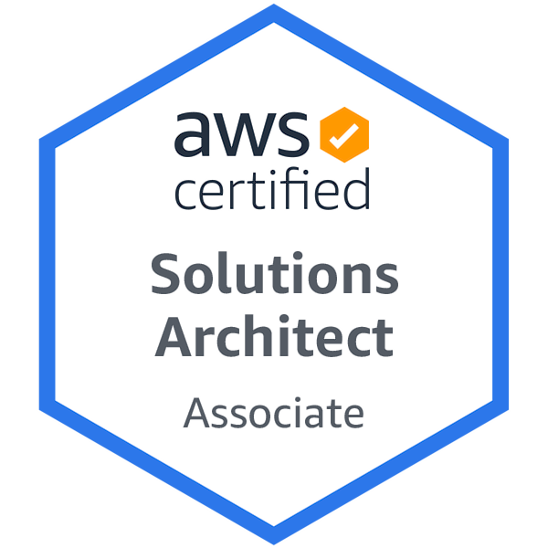

# Hi there! 

## 🚀 About Me

I am Muhammad Hammad, a **Full Stack Software Developer** based out of Canada. I have a passion for learning new technologies and expanding my knowledge on all things cloud. Currently I enjoy building well-architected, highly available large scale cloud applications.

## 💡 Interesting Things

-   ☁️ I am AWS Certified Solutions Architect – Associate
-   ☁️ I am AWS Certified Cloud Practitioner
-   📝 I wrote an open source package for Soy files - [SoyServe](https://github.com/mhnaeem/SoyServe)
-   🎓 I hold a BSc in Compute Science & Business from Memorial University of Newfoundland and Labrador

**Note:** If you have any open source projects in mind that I can help with then please feel free to contact me

## 🏅 Badges

## 🔗 Links

- [LinkedIn](https://www.linkedin.com/in/mhnaeem99/)
- [Website](https://www.cs.mun.ca/~mhnaeem/)
- [NPM](https://www.npmjs.com/~mhnaeem)
